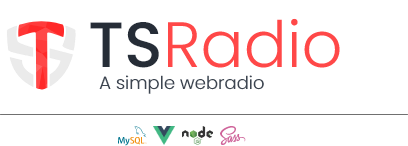

The next version of TSRadio. Completely re-written from scratch using modern techniques, enabling a better experience than before.

## Planned Features
- [x] Play audio streams (Front-end)
- [x] Stream audio to icecast (Back-end)
- [ ] Create / Manage channels through webinterface
- [ ] Create / Manage users through webinterface

## Prerequisites
* OS: Linux (Win will be supported in the late future)
* NodeJS v12
* MySQL as database

## Setup icecast to be configured by the api automatically
For this to work, you need to have both icecast2 and the api running on the same machine. <br>
First you create the configured icecast.xml in icecast's root directory (e.g.: /etc/icecast2/icecast.xml). You maybe want to configure your credentials and other options first.
<br> Now that you have that file, create a symlink inside the api's root directory using the following command (please change some values to match your environment):

```
    (sudo) ln -s /etc/icecast2/icecast.xml /path/to/api/icecast.xml
```

The file needs read/write access for the user running the tsradio api.<br>
Now whenever a new channel is created, the api modifies the icecast.xml with mount specific options (<b>SOON: </b>and automatically restart the icecast server). <br><br>
Now a symlink is created to the original file through which, the nodejs application can access the file and configure new or updated mountpoints. You can even modify the file to your needs.